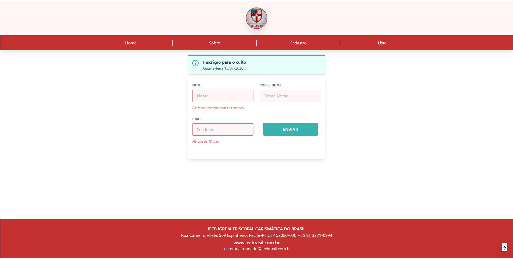

# Cult-Registration

[](http://hits.dwyl.com/KleytonLeite/KleytonLeite/Cult-Registration-git)

<h1 align="center">
  
</h1>

## 📝 Description

**Cult-Registration** Registration system for services in this pandemic period.

---

## 💻 Used Technologies

This project has been developed using the following technologies:

- React js
- Next js
- JavaScript
- Node js

---

## 📁 Download

```bash

# Clone the repository
$ git clone https://github.com/KleytonLeite/Cult-Registration.git

# Enter into the directory
$ cd Cult-Registration

# Install dependencies
$ npm install

# Start the server
$ npm start

```

---

Made with 💙 by Kleyton Leite 👋🏻 [Get in touch!](https://www.linkedin.com/in/kleyton-leite-a384a76b/)


